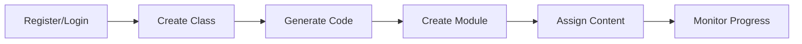
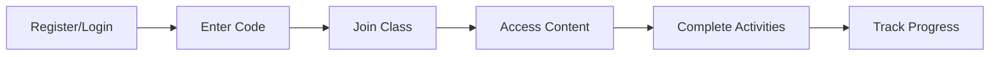

# Superkelas - MVP Documentation
Platform pembantu guru dalam membuat dan menyampaikan pembelajaran yang lebih interaktif

## Overview
Superkelas adalah platform yang membantu guru membuat modul ajar dan menyampaikannya dalam format yang lebih interaktif kepada siswa. Platform ini independen dari sistem sekolah, memungkinkan guru untuk berkreasi dan berinovasi dalam pembelajaran.

## Target User
1. **Guru**
   - Ingin membuat pembelajaran lebih interaktif
   - Mencari cara efisien membuat modul ajar
   - Perlu platform untuk menyampaikan materi tambahan
   - Ingin tracking progress siswa

2. **Siswa/Orangtua**
   - Butuh akses materi tambahan
   - Ingin belajar dengan cara yang lebih interaktif
   - Perlu tracking progress pembelajaran

## Core Problems & Solutions

### Guru
| Problem | Solution | Priority |
|---------|----------|----------|
| Pembuatan modul ajar manual memakan waktu | Generator modul ajar otomatis | High |
| Sulit membuat pembelajaran interaktif | Template aktivitas & quiz system | High |
| Materi pembelajaran tersebar | Centralized content management | Medium |
| Tracking progress manual | Automated progress tracking | Medium |

### Siswa
| Problem | Solution | Priority |
|---------|----------|----------|
| Akses materi terbatas | Centralized learning content | High |
| Pembelajaran kurang interaktif | Interactive learning tools | High |
| Sulit mengukur kemajuan | Progress tracking system | Medium |
| Jadwal pembelajaran berantakan | Calendar & reminder system | Low |

## Core Features & Functionalities

### 1. User Management
- **Account Creation**
  - Role-based (teacher/student)
  - Basic profile
  - Class management

- **Dashboard**
  - Role-specific views
  - Quick actions
  - Activity overview

### 2. Class System
- **For Teachers**
  - Create virtual class
  - Generate class code
  - Manage students
  - Assign content

- **For Students**
  - Join via code
  - Access materials
  - Submit assignments
  - View progress

### 3. Modul Creator
- **Basic Generation**
  - Convert CP to tujuan pembelajaran
  - Generate pertanyaan pemantik
  - Create activity templates

- **Content Management**
  - Upload materials
  - Organize content
  - Share resources

### 4. Learning Tools
- **Quiz System**
  - Create quizzes
  - Auto-grading
  - Result analytics

- **Progress Tracking**
  - Completion status
  - Performance metrics
  - Achievement system

## User Flow

### Teacher Journey


### Student Journey


## Technical Requirements

### Frontend
- Single Page Application
- Responsive design
- Offline capability
- Cross-browser support

### Backend
- RESTful API
- Secure authentication
- File management
- Real-time updates

### Infrastructure
- Cloud hosting
- CDN integration
- Database backup
- SSL security

## Success Metrics
1. **Engagement**
   - Daily active users
   - Time spent per session
   - Feature usage rate

2. **Learning**
   - Content completion rate
   - Quiz performance
   - Student progress

3. **Technical**
   - Load time < 3s
   - Uptime > 99%
   - Error rate < 1%

## Future Considerations
- Advanced analytics
- AI-powered recommendations
- Community features
- Marketplace integration
- Parent portal

# Superkelas Development Action Items - MVP Focus
Tech Stack: React, NextJS, TypeScript, Tailwind CSS, shadcn/ui, Supabase

## Phase 1: Foundation

### Sprint 1: Project Setup & Authentication
#### Project Foundation
- [x] Initialize Next.js project with TypeScript
- [x] Configure Tailwind CSS and shadcn/ui
- [ ] Setup project architecture and folder structure
- [ ] Configure Supabase project and initial schema

#### Authentication System
- [ ] Implement login/register flows
- [ ] Setup email verification system
- [ ] Create password reset functionality
- [ ] Configure protected routes

### Sprint 2: Core User Experience
#### Profile System
- [ ] Build user profile management
- [ ] Implement role-based access control
- [ ] Setup profile image handling with Supabase
- [ ] Create account settings interface

#### Layout & Navigation
- [ ] Design and implement responsive layout
- [ ] Build role-based navigation
- [ ] Create mobile-friendly design
- [ ] Implement theme switching

### Sprint 3: Dashboard Implementation
#### Teacher Dashboard
- [ ] Create dashboard layout with metrics
- [ ] Build quick actions panel
- [ ] Implement activity feed
- [ ] Design class overview cards

#### Student Dashboard
- [ ] Build active classes display
- [ ] Create assignments view
- [ ] Implement progress indicators
- [ ] Design learning materials access

### Sprint 4: Class Management
#### Class Creation & Management
- [ ] Build class creation workflow
- [ ] Implement class code generation
- [ ] Create class settings interface
- [ ] Design member management system

#### Class Participation
- [ ] Create class joining process
- [ ] Build class overview interface
- [ ] Implement member listing
- [ ] Design basic class interactions

## Phase 2: Learning Tools

### Sprint 5: Modul Creator Foundation
#### Basic Modul Structure
- [ ] Create modul creation interface
- [ ] Implement subject/grade management
- [ ] Build learning objectives system
- [ ] Design period configuration

#### Content Structure
- [ ] Build module organization system
- [ ] Create content templates
- [ ] Implement content editor
- [ ] Setup draft saving system

### Sprint 6: Content Management
#### File Management
- [ ] Implement file upload system
- [ ] Create file organization structure
- [ ] Build media library interface
- [ ] Setup file access control

#### Content Organization
- [ ] Create content categorization
- [ ] Implement search functionality
- [ ] Build filter and sort system
- [ ] Design content sharing

### Sprint 7: Assessment System
#### Quiz Creation
- [ ] Build quiz builder interface
- [ ] Implement multiple question types
- [ ] Create quiz settings system
- [ ] Design question bank

#### Assessment Management
- [ ] Create quiz distribution system
- [ ] Implement auto-grading
- [ ] Build results dashboard
- [ ] Design basic analytics

### Sprint 8: Learning Experience
#### Student Learning Interface
- [ ] Create content viewing system
- [ ] Build quiz taking interface
- [ ] Implement progress tracking
- [ ] Design achievement system

#### Teacher Management Tools
- [ ] Create assignment management
- [ ] Implement grade book
- [ ] Build progress monitoring
- [ ] Design performance insights

## Phase 3: Essential Features

### Sprint 9: Calendar & Planning
#### Calendar System
- [ ] Create interactive calendar
- [ ] Build event management
- [ ] Implement schedule planning
- [ ] Design due date tracking

#### Planning Tools
- [ ] Build assignment scheduler
- [ ] Create course planning features
- [ ] Implement timeline visualization
- [ ] Design resource allocation

### Sprint 10: Notification & Communication
#### Notification System
- [ ] Implement in-app notifications
- [ ] Setup email notifications
- [ ] Create notification preferences
- [ ] Design notification center

#### Communication Tools
- [ ] Build announcement system
- [ ] Implement basic messaging
- [ ] Create communication preferences
- [ ] Design activity feeds

## Infrastructure Setup
### Supabase Configuration
- [ ] Configure authentication
- [ ] Design and implement database schema
- [ ] Setup storage buckets
- [ ] Configure real-time subscriptions

### Frontend Architecture
- [ ] Organize component library
- [ ] Setup state management
- [ ] Create API integration patterns
- [ ] Implement error handling

### Development Operations
- [ ] Setup CI/CD pipeline
- [ ] Configure development and production environments
- [ ] Setup basic monitoring
- [ ] Implement backup strategy

# Tech STack

This is a [Next.js](https://nextjs.org) project bootstrapped with [`create-next-app`](https://nextjs.org/docs/app/api-reference/cli/create-next-app) and Typescript support.

And use some popular library like:
- tailwindcss
- shadcn ui
- mdx

## Getting Started

First, run the development server:

```bash
npm run dev
# or
yarn dev
# or
pnpm dev
# or
bun dev
```

Open [http://localhost:3000](http://localhost:3000) with your browser to see the result.

You can start editing the page by modifying `app/page.tsx`. The page auto-updates as you edit the file.

This project uses [`next/font`](https://nextjs.org/docs/app/building-your-application/optimizing/fonts) to automatically optimize and load [Geist](https://vercel.com/font), a new font family for Vercel.

# Components can be added using the CLI (example)
```bash
npx shadcn@latest add <component-name>
```
